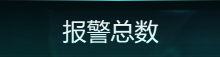

# 实现过的一些技术

## 文字上下渐变

```css
.font {
    font-family: Helvetica;
    font-size: 1.5rem;
    position: absolute;
    top: 26%;
    left: 0;
    width: 100%;
    text-align: center;
    // 核心代码
    color: transparent;
    background-image: linear-gradient(to bottom, #EEEEEE, #C5FFFE);
    -webkit-background-clip: text;
    background-clip: text;
    filter: drop-shadow(0 0 0 rgba(255, 255, 255, 0.5));
}
```
