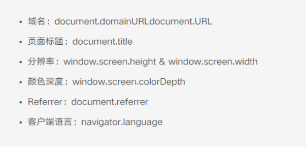
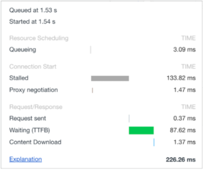

# 事情的原委

领导：我们的项目发展到一定阶段了，想看下项目的使用情况，用户访问了哪些页面，点了哪些按钮
我：好的，我去预研一下技术方案
领导：我看友盟不错，你预研一下
我：好的，友盟可能需要收费
领导：……，我们工期也比较紧
我：好的，我先写一个满足需求的，先跑起来再说

# 我要做什么

> 项目的使用情况

从不同的视图会得到不同的需求

1.  从产品视角看，在意的是pv、uv、转化率、页面留存、发送了什么等。一般叫做埋点
2.  从研发视角看，在意的是性能（首屏时间、资源加载耗时）、错误（JavaScript错误、资源加载1异常）、用户体验（白屏、卡顿等）。一般叫做监控

## 埋点、监控傻傻分不清楚

其实很多产品、研发对于埋点和监控都没有很清晰的边界。像我的产品就会把埋点和监控的功能都混在一份excel里面发给我，我和我的主管、同时讨论的时候，也会出现两个内容混做一谈的情况。

那么这两个到底怎么区分呢？

### 埋点

埋点主要用于收集用户行为数据。捕获特定用户行为（如点击、浏览、提交表单、页面跳转等）以及关键业务数据（如下单金额、商品类别等）

将用户对项目交互情况上报到收集平台，做数据统计，数据分析，为产品如何更好的规划项目提供数据方面的支持，也为业务的实现情况提供数据的支撑。

所以一定不会离开一些维度的数据：地理位置、页面路径、浏览器信息、用户标识、时间戳等等。还会有一些业务相关的：比如点击了哪些页面，访问了哪些内容，业务之间的转化率等等，就会附带一些业务的标识。

### 监控

监控则主要关注系统的性能和稳定性。

监控主要是从技术的角度分析项目，比如项目有没有出错，出了哪些错误，性能怎么样，用户要等多久等等方面为项目提供数据的支持。所以也就细分为JS错误监控，接口错误监控，页面性能监控，资源加载监控……巴拉巴拉的。

监控实现的原理是什么？
无非就是几个API

1.  JS错误：
    1.  windwo.onerror
    2.  window.addEventListener('unhandledrejection', func)
    3.  
2.  接口异常：axios的响应拦截器，fetch、xhr包一层函数
3.  页面性能：PerformanceAPI
4.  资源加载错误：script标签，img标签都支持

# 我要怎么做

当我们理清楚了什么是什么之后，就会诞生新的问题：然后嘞？

## 埋点

站在产品的角度拆分问题：发生了什么事情（上报什么事件）

1.  用户什么时候登陆的
2.  用户什么时候登出的
3.  用户访问了哪些地址
4.  用户访问了哪些业务逻辑

### 埋点的分类

埋点分为：
- 手动埋点（代码埋点）
  - 优点：可以自定义事件，支持事件漏斗等功能，定制性强
  - 缺点：设计、开发工作量大
- 无痕埋单（全量埋点）
  - 优点：代码侵入少
  - 缺点：无法定制数据，会有大量的脏数据，服务器压力大
- 可视化埋点：通过工具界面标记需要采集的元素和事件，可以不用手写代码。

```js
/**
 * 无痕埋单
 */
export function autoTrackerReport() {
  // 无痕埋单
  document.body.addEventListener('click', function (e) {
    const clickedDom = e.target;

    // 获取标签上的data-eventName属性的值
    let eventName = clickedDom?.getAttribute('data-eventName');

    // 获取标签上的data-isTrackUp属性的值(在需要手动上报的地方设置data-isTrackUp)
    let isTrackUp = clickedDom?.getAttribute('data-isTrackUp');
    // 避免重复上报
    if (!isTrackUp) {
      return;
    }

    if (target) {
      report('action', {
        actionType: 'click',
        eventName
      });
    } else {
      // 当前路径
      const path = getReportPath();
      report('action', {
        actionType: 'click',
        data: path
      });
    }
  });

   // --------  js error ---------
 const originOnError = window.onerror;
 window.onerror = function (msg, url, row, col, error) {
   // 处理原有的onerror
   if (originOnError) {
     originOnError.call(window, msg, url, row, col, error);
   }
   // 错误上报
   lazyReport('error', {
     message: msg,
     file: url,
     row,
     col,
     error,
     errorType: 'jsError'
   });
 }

 // ------  promise error  --------
 window.addEventListener('unhandledrejection', (error) => {
   lazyReport('error', {
     message: error.reason,
     error,
     errorType: 'promiseError'
   });
 });

 // ------- resource error --------
 window.addEventListener('error', (error) => {
   let target = error.target;
   let isElementTarget = target instanceof HTMLScriptElement || target instanceof HTMLLinkElement || target instanceof HTMLImageElement;
   if (!isElementTarget) {
     return; // js error不再处理
   }
   lazyReport('error', {
     message: "加载 " + target.tagName + " 资源错误",
     file: target.src,
     errorType: 'resourceError'
   });
 }, true)
}
```

### 埋点内容

- PV：PageVisit 一天内访问该网站某个页面的访问量
- UV：UserVisit 一天内访问该网站的用户数

## 监控

站在研发大佬的角度分析问题：性能怎么样（没出啥大问题吧）

1.  首屏响应的时间
2.  项目出了哪些错误
3.  页面的加载资源情况怎么样

# 如何去做呢（这里会干一些）

## 埋点

所谓数据监控就是能拿到用户的行为，我们也需要注意那么几点：

1.  PV访问来量（Page View）
2.  UV访问数（Unique Visitor）
3.  记录操作系统和浏览器
4.  记录用户在页面的停留时间
5.  进入当前页面的来源网页（也就是从哪进来的转化）


> 页面的基本信息



> 页面的性能信息



我咋拿嘞？

```js
// 通过 performanceAPI 获取参数
let timing = performance.timing,
    start = timing.navigationStart,
    dnsTime = 0,
    tcpTime = 0,
    firstPaintTime = 0,
    domRenderTime = 0,
    loadTime = 0;
// 根据提供的api和属性，拿到对应的时间
dnsTime = timing.domainLookupEnd - timing.domainLookupStart;
tcpTime = timing.connectEnd - timing.connectStart;
firstPaintTime = timing.responseStart - start;
domRenderTime = timing.domContentLoadedEventEnd - start;
loadTime = timing.loadEventEnd - start;

console.log('DNS解析时间:', dnsTime, 
            '\nTCP建立时间:', tcpTime, 
            '\n首屏时间:', firstPaintTime,
            '\ndom渲染完成时间:', domRenderTime, 
            '\n页面onload时间:', loadTime);

```

```js
  // 页面加载时发送埋点请求
$(document).ready(function(){
 // ... 这里存在一些业务逻辑
 sendRequest(params);
});
// 按钮点击时发送埋点请求
$('button').click(function(){
   //  这里存在一些业务逻辑
   sendRequest(params);
});
  // 通过伪装成 Image 对象，传递给后端，防止跨域
    let img = new Image();
    let src = `http://xxx/a.jpg?args=${encodeURIComponent(args)}`;
    img.src = src;
//css实现的埋点
    .link:active::after{
    content: url("http://www.example.com?action=yourdata");
}
<a class="link">点击我，会发埋点数据</a>
//data自定义属性，rangjs去拿到属性绑定事件，实现埋点
//<button data-mydata="{key:'uber_comt_share_ck', act: 'click',msg:{}}">打车</button>
```

# 插件实现

## 埋点插件使用

```js
import Track from "vue2-track-library";
import Storage from "@/utils/sessionStorage";

import { buryPointAddBuryPointInfoV2, bossReportAddBuryPointInfoV2, getUserInfo, getClientIp, getBossReportIP } from "./plugins/monitor/api.js";
import monitorModuleEnum, { getModuleName } from "./plugins/monitor/monitorModuleEnum";

async function getBossUserInfo(axios) {
  let ip;
  const res1 = await getBossReportIP(axios);
  if (res1.success) {
    ip = res1.data;
  }
  let projectCode = Storage.get("projectCode");
  // 移动度获取用户信息
  let userInfo = {
    phoneNum: Storage.get("mobilePhone"),
    token: localStorage.getItem(`mobileToken_${projectCode}`),
    projectCode,
    ip,
    type: 2
  };

  return userInfo;
}

async function getPCUserInfo(axios) {
  const res = await getUserInfo(axios);
  let projectCode;
  let ip;
  if (res.success) {
    projectCode = res.data.projectInfo.code;
  }

  const res1 = await getClientIp(axios);
  if (res1.success) {
    ip = res1.data;
  }

  let userInfo = {
    account: Storage.get("username"),
    userName: Storage.get("nickname"),
    userType: Storage.get("userType"),
    token: Storage.get("token"),
    projectCode,
    ip,
    type: 1
  };

  return userInfo;
}

/**
 * 根据环境获取上报函数
 * @param {import("axios").AxiosInstance} axios
 * @returns 上报信息的接口函数
 */
function getBuryFunc(axios) {
  return isMobile
    ? async params => {
        return bossReportAddBuryPointInfoV2(axios, params);
      }
    : async params => {
        return buryPointAddBuryPointInfoV2(axios, params);
      };
}

Vue.use(Track, {
  router,
  projectCode: "text_H5",
  isLogin: () => (location.hash.includes("#/mobile") ? !location.href.includes("login") && sessionStorage.getItem("mobilePhone") : sessionStorage.getItem("token")),
  getUserInfo: async () => {
    if (isMobile) {
      return await getBossUserInfo(service);
    } else {
      // PC 端获取用户信息
      return await getPCUserInfo(service);
    }
  },
  trackEvent: getBuryFunc(service),
  getTrackData: originData => {
    return { ...originData, page: originData.url, pageFunc: originData.eventName };
  },
  registerFunc(Vue, config) {
    Vue.prototype.location = window.location;
    Vue.prototype.__monitorModuleEnum = monitorModuleEnum;

    /**
     * 菜单点击埋点
     * @param {string} pageFunc
     * @param {string} page
     * @param {string} remark
     */
    Vue.prototype.trackMenuClick = function(page, pageFunc, module, remark) {
      config.trackEvent(
        config.getTrackData({
          page,
          pageFunc,
          remark,
          module
        })
      );
    };
  }
});

```